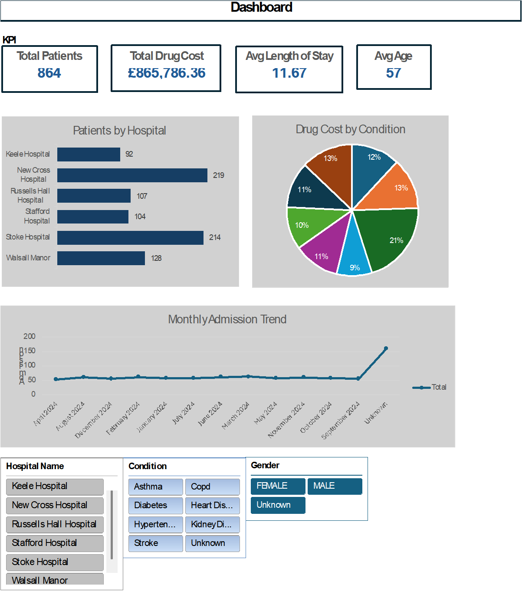

# NHS Healthcare Excel Dashboard

## Project Overview

This project demonstrates data cleaning, analysis, and dashboard creation using Microsoft Excel.

The dataset contains 1500 simulated healthcare records with messy data including duplicates, missing values, and inconsistent formatting.

## Tasks Performed

* Data cleaning (handling missing values and duplicates)
* Data transformation
* Pivot table analysis
* KPI calculation
* Interactive dashboard creation

## Dashboard Features

* Total Patients KPI
* Total Drug Cost KPI
* Average Length of Stay
* Patients per Hospital
* Drug Cost by Condition
* Monthly Admission Trends
* Interactive slicers (Hospital, Condition, Gender)

## Tools Used

* Microsoft Excel
* Pivot Tables
* Charts
* Data Cleaning Techniques

## Dashboard Preview

